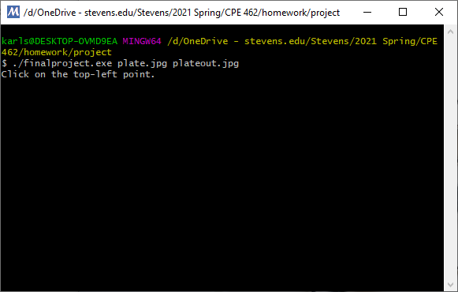
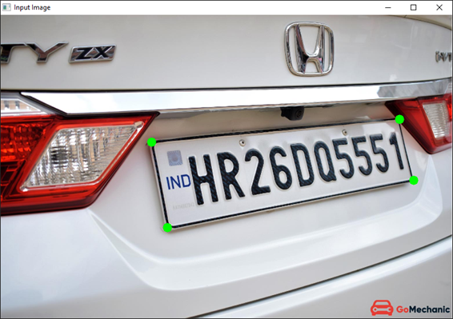
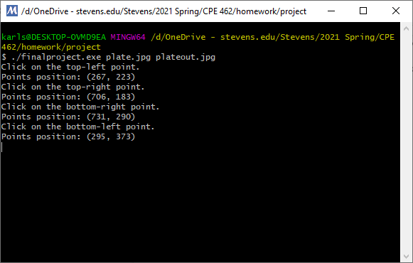
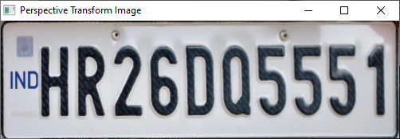
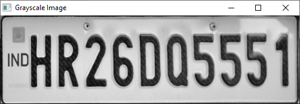
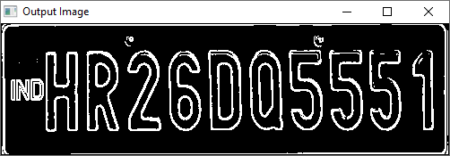
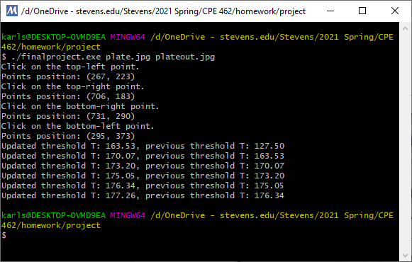

# CPE-462 Image Processing and Coding
## Edge Detection in Selected Region
### Instruction:
1. Compile *FinalProject.cpp*.
2. Run *finalproject.exe* in the command line.
    * Usage: ./finalproject.exe \<input filename> \<output filename>
    
3.  Follow the instructions in the command window.
    * Select the region in the original image that you want to process.
    * Start with the top-left corner and click on the four corners of the region
clockwise.
    
    
4. Perspective transform image and grayscale image will be displayed on the screen.
    
    
5. Output image will be saved to the current folder.
    
    

